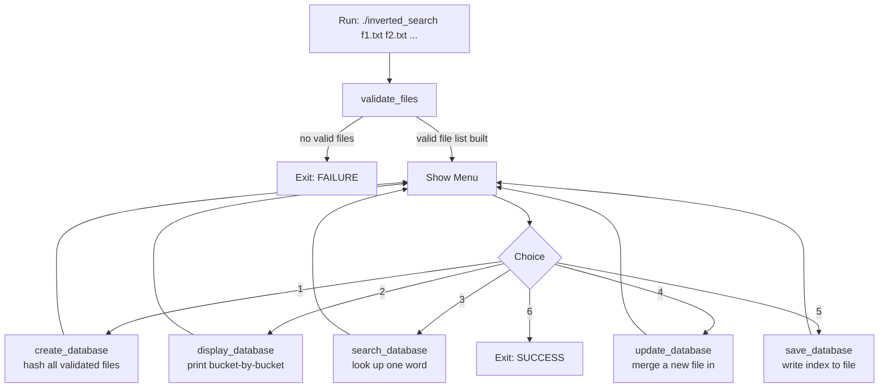

# Inverted Search

A menu-driven C program that builds an **inverted index** over a set of text files, so you can look up a word and instantly see which files contain it and how many times.

## Concept

Two ways to index a set of documents:

| | Maps | Real-world analogy |
|---|---|---|
| **Forward index** | file → words | Table of contents in a book |
| **Inverted index** | word → files | Index at the back of a book |

This project builds an inverted index: given `word`, it answers *"which files contain this word, and how often?"* — the same problem search engines solve at scale.

## Data Structures

The index is a hash table of `TOTAL_BUCKETS` (27) buckets: 26 for letters `a`–`z`, plus one (`SPECIAL_INDEX`, 26) for anything that isn't a letter (digits, punctuation, symbols).

```
hash_t arr[27]
 ├─ [0] 'a' bucket -> main_node -> main_node -> NULL   (mlink chain)
 ├─ [1] 'b' bucket -> ...
 ...
 └─ [26] special bucket (digits/symbols)
```

Each bucket holds a chain of **`main_node`** entries (one per distinct word hashed to that bucket), and each word in turn holds a chain of **`sub_node`** entries (one per file that word appears in):

```
main_node                     sub_node             sub_node
┌─────────────┐   sublink    ┌───────────┐ slink  ┌───────────┐
│ word: "hi"  ├─────────────>│ f1.txt    ├───────>│ f2.txt    │──> NULL
│ file_count:2│              │ count: 3  │        │ count: 1  │
│ mlink       │              └───────────┘        └───────────┘
└──────┬──────┘
       │ (next word in same bucket)
       v
   main_node "how" ...
```

So there are two distinct linked-list dimensions in play:

- **`mlink`** — chains different **words** that hashed into the same bucket (collision handling).
- **`sublink` / `slink`** — chains the **files** a single word appears in.

Bucket index is computed as `tolower(word[0]) % 97` (since `'a' == 97` in ASCII), clamped to `SPECIAL_INDEX` when it exceeds 25. This means **hashing is case-insensitive** (`"Hi"` and `"hi"` land in the same bucket), but **word storage and lookup are case-sensitive** (`strcmp`), so `"Hi"` and `"hi"` are still tracked as separate entries within that bucket.

A fourth structure, **`flist`**, is a simple linked list of validated input filenames, built once before the database is created.

## Project Structure

```
.
├── main.c              Menu-driven driver (create/display/search/update/save/exit)
├── main.h              Struct definitions, constants, function prototypes
├── validate.c           Validates CLI file arguments (exists, non-empty, no duplicates)
├── create_database.c    Builds the hash table from all validated files
├── display_database.c   Prints the full index, bucket by bucket
├── search_database.c    Looks up a single word and prints its file/count breakdown
├── update_database.c    Merges one additional file into an existing index
└── save_database.c      Writes the index out to a flat text file
```

## Workflow



1. **Validate** (`validate_files`) — checks every filename passed on the command line: does it exist, is it non-empty, is it a duplicate of one already accepted. Only files that pass are linked into `flist`; the rest are skipped with a message.
2. **Create Database** (`create_database`) — walks `flist`, reads each file word by word (`fscanf("%s")`), hashes each word into a bucket, and either creates a new `main_node`/`sub_node` pair or increments an existing word's per-file count.
3. **Display Database** (`display_database`) — iterates every bucket and prints each word alongside its file/count breakdown in a formatted table.
4. **Search Database** (`search_database`) — hashes the given word to find its bucket, walks the `mlink` chain for an exact match, then walks that word's `sublink`/`slink` chain to report per-file counts.
5. **Update Database** (`update_database`) — reads one additional file and folds its words into the existing in-memory index (same insert/increment logic as create, for a single file).
6. **Save Database** (`save_database`) — serializes the entire index to a text file, one line per word: `index[<bucket>] <word> <file_count> <file1> <count1> <file2> <count2> ...`

## Build

```bash
gcc -Wall -Wextra *.c -o inverted_search
```

## Run

```bash
./inverted_search f1.txt f2.txt f3.txt
```

Then drive it from the menu:

```
1. Create Database
2. Display Database
3. Search Database
4. Update Database
5. Save Database
6. exit
```


## Author

Satheeswaran M — [github.com/sathees-waran](https://github.com/sathees-waran)

